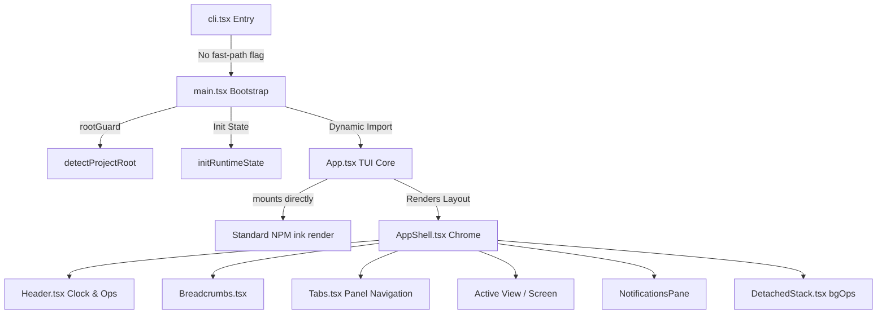
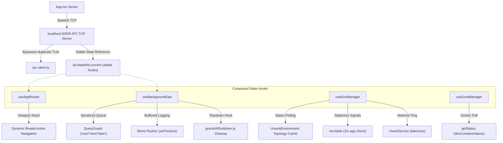

# UNAXIS TUI Architectural Context Map (`TUI_MAP.md`)

This document serves as the canonical architectural map and field guide for the Terminal User Interface (TUI) codebase of the `webbymk2` ("Unaxis") project. It details the runtime assembly layers, active visual hierarchies, global state orchestration hooks, and specifically clarifies the split between active React 18/Ink 4 execution structures and dead/ignored React 19/Claude Code stub imports.

---

## 1. Overview & Execution Flow

The Unaxis TUI is designed to operate as a low-level, high-fidelity system control plane. It functions on a pinned sub-project approach utilizing React 18.3.1 and Ink 4.4.1 (isolated via [tsconfig.json](file:///z:/WEBSITES/webbymk2/src/ink/tsconfig.json) and [package.json](file:///z:/WEBSITES/webbymk2/src/ink/package.json)) to run safely without conflict from the root project's React 19 dependencies.

### 1.1 Bootstrap Chain
When the TUI is launched (via scripts or CLI commands), it traverses a strict startup flow:
1. **CLI Flag Parser**: [cli.tsx](file:///z:/WEBSITES/webbymk2/src/entrypoints/cli.tsx) intercepts flags (`--version`, `--help`) or handles fast-path operations (`unaxis config set`, `unaxis credentials set`).
2. **IPC Forwarding Router**: If an operational subcommand (e.g., `unaxis dev <zone>`, `unaxis restart <zone>`, `unaxis status`) is issued, [cli.tsx](file:///z:/WEBSITES/webbymk2/src/entrypoints/cli.tsx) dynamically imports [ipc-client.ts](file:///z:/WEBSITES/webbymk2/src/ink/ipc-client.ts) and forwards the request to the active TUI TCP server (listening on localhost port `50505`) instead of launching a second instance.
3. **Runtime Assembly Bootstrap**: If no fast-path exit applies, [cli.tsx](file:///z:/WEBSITES/webbymk2/src/entrypoints/cli.tsx) loads [main.tsx](file:///z:/WEBSITES/webbymk2/src/main.tsx).
4. **Root Guard & Env Loading**: [main.tsx](file:///z:/WEBSITES/webbymk2/src/main.tsx) invokes `detectProjectRoot` to resolve project markers, updates CWD, loads `.env` rules, initializes the global state store, and dynamically loads [App.tsx](file:///z:/WEBSITES/webbymk2/src/ink/App.tsx) to render the React tree.
5. **Terminal Mounting**: [App.tsx](file:///z:/WEBSITES/webbymk2/src/ink/App.tsx) binds itself directly to standard Ink's `render()` method, overriding console logging, setting up custom handlers for `Ctrl-C` exits, spawning the IPC TCP server, and rendering the terminal loop.



---

## 2. React 18 / 19 and Engine Split

The codebase contains files belonging to two separate terminal rendering models: the active React 18 / Ink 4 TUI ("Unaxis") and legacy React 19 custom reconciler / Claude Code stubs. To guide future development and avoid wasting cognitive overhead, all files are classified into four strict structural tiers.

### Tier 1: Adapted & Populated (Active Design System & Component wrappers)
*These represent the active, first-batch design system components and their compatibility wrappers. They are fully operational and are in active use.*
* [index.ts](file:///z:/WEBSITES/webbymk2/src/ink/components/design-system/index.ts) - Design system entrypoint.
* [StatusIcon.tsx](file:///z:/WEBSITES/webbymk2/src/ink/components/design-system/StatusIcon.tsx) - Custom visual state indicators.
* [ProgressBar.tsx](file:///z:/WEBSITES/webbymk2/src/ink/components/design-system/ProgressBar.tsx) - TUI rendering bar for operations.
* [ProgressLine.tsx](file:///z:/WEBSITES/webbymk2/src/ink/components/design-system/ProgressLine.tsx) - Horizontal progression lines.
* [MetricCard.tsx](file:///z:/WEBSITES/webbymk2/src/ink/components/design-system/MetricCard.tsx) - CPU/Memory card panels.
* [LoadingState.tsx](file:///z:/WEBSITES/webbymk2/src/ink/components/design-system/LoadingState.tsx) - Active spinner screens.
* [Pane.tsx](file:///z:/WEBSITES/webbymk2/src/ink/components/design-system/Pane.tsx) - Structured layouts and boundary frames.
* [SectionFrame.tsx](file:///z:/WEBSITES/webbymk2/src/ink/components/design-system/SectionFrame.tsx) - Group boundaries.
* [ListItem.tsx](file:///z:/WEBSITES/webbymk2/src/ink/components/design-system/ListItem.tsx) - Standard styled list items.
* [Byline.tsx](file:///z:/WEBSITES/webbymk2/src/ink/components/design-system/Byline.tsx) - Secondary metadata labels.
* [Divider.tsx](file:///z:/WEBSITES/webbymk2/src/ink/components/design-system/Divider.tsx) - Horizontal section dividers.
* [ThemeProvider.tsx](file:///z:/WEBSITES/webbymk2/src/ink/components/design-system/ThemeProvider.tsx) - System color palette provider.
* [ThemedBox.tsx](file:///z:/WEBSITES/webbymk2/src/ink/components/design-system/ThemedBox.tsx) - Theme-aware container wrappers.
* [ThemedText.tsx](file:///z:/WEBSITES/webbymk2/src/ink/components/design-system/ThemedText.tsx) - Theme-aware label overrides.
* Component-level Active Wrappers:
  * [Pane.tsx](file:///z:/WEBSITES/webbymk2/src/ink/components/Pane.tsx) - Active backward-compatibility wrapper redirecting to design-system elements.
  * [ListItem.tsx](file:///z:/WEBSITES/webbymk2/src/ink/components/ListItem.tsx) - Backward-compatible active list item wrapper.
  * [StatusIcon.tsx](file:///z:/WEBSITES/webbymk2/src/ink/components/StatusIcon.tsx) - Active status icon adapter.

---

### Tier 2: Obvious Disconnected Scaffold / Donor Files (Dead Code)

> [!WARNING]
> **CRITICAL MANDATE FOR FUTURE AGENTS AND DEVELOPERS:**
> The files listed in Tier 2 represent dead, inactive donor files and legacy scaffolding copied from Claude Code or legacy React 19 frameworks. They are **NOT connected to the active runtime path** and **must be completely ignored**. Do not attempt to modify, import, or adapt them when fixing bugs, optimizing state, or adding features to the active Unaxis TUI.

* **Dead Shell Launchers**:
  * [replLauncher.tsx](file:///z:/WEBSITES/webbymk2/src/replLauncher.tsx) - Legacy alternative CLI mounting script (unused).
  * [interactiveHelpers.tsx](file:///z:/WEBSITES/webbymk2/src/interactiveHelpers.tsx) - Copy-pasted helper stubs (unused).
  * [ink.ts](file:///z:/WEBSITES/webbymk2/src/ink.ts) - Workspace root file bridging custom elements (unused).
* **Dead SDK Schema Directories**:
  * [controlSchemas.ts](file:///z:/WEBSITES/webbymk2/src/entrypoints/sdk/controlSchemas.ts) - Unused donor schema shapes.
  * [coreSchemas.ts](file:///z:/WEBSITES/webbymk2/src/entrypoints/sdk/coreSchemas.ts) - Unused donor validator functions.
  * [coreTypes.generated.ts](file:///z:/WEBSITES/webbymk2/src/entrypoints/sdk/coreTypes.generated.ts) - Unused generated type stubs.
  * [index.ts](file:///z:/WEBSITES/webbymk2/src/entrypoints/sdk/index.ts) - Dead SDK module exporter.
  * [runtimeTypes.ts](file:///z:/WEBSITES/webbymk2/src/entrypoints/sdk/runtimeTypes.ts) - Unused system schemas.
  * [toolTypes.ts](file:///z:/WEBSITES/webbymk2/src/entrypoints/sdk/toolTypes.ts) - Unused terminal tool types.
* **Dead Copy & Helper Files**:
  * [config copy.ts](file:///z:/WEBSITES/webbymk2/src/utils/config%20copy.ts) - Dead backup duplicate configuration.
  * [fsOperations copy.ts](file:///z:/WEBSITES/webbymk2/src/utils/fsOperations%20copy.ts) - Dead file system operation duplicate.
  * [terminalPanel.ts](file:///z:/WEBSITES/webbymk2/src/utils/terminalPanel.ts) - Unused donor terminal viewport panel.
  * [pluginLoader.ts](file:///z:/WEBSITES/webbymk2/src/utils/plugins/pluginLoader.ts) - Extraneous legacy extension loading manager (unused).
* **Dead Git Worktree Management**:
  * [worktree.ts](file:///z:/WEBSITES/webbymk2/src/utils/worktree.ts) - Legacy workspace cloning utility.
  * [worktree.ts](file:///z:/WEBSITES/webbymk2/src/ink/hooks/worktree.ts) - Hook driving worktree UI updates (unused).
  * [worktree.ts](file:///z:/WEBSITES/webbymk2/src/ink/utils/worktree.ts) - Helper classes for workspace manipulation (unused).

---

### Tier 3: Local Ink Engine Files (Disconnected custom Reconciler & Yoga core)
*These represent a custom-written terminal DOM model, a fiber reconciler, Yoga layout bindings, and virtual viewports ported into the system for experimental purposes. They are currently disconnected from active rendering but preserved for future custom engine architecture.*
* **Custom Reconciler Core**:
  * [root.ts](file:///z:/WEBSITES/webbymk2/src/ink/root.ts) - Fiber root node manager.
  * [ink.tsx](file:///z:/WEBSITES/webbymk2/src/ink/ink.tsx) - Custom reconciler bridge.
  * [reconciler.ts](file:///z:/WEBSITES/webbymk2/src/ink/reconciler.ts) - React fiber reconciler structure.
  * [renderer.ts](file:///z:/WEBSITES/webbymk2/src/ink/renderer.ts) - Custom screen renderer coordinates.
  * [dom.ts](file:///z:/WEBSITES/webbymk2/src/ink/dom.ts) - Custom terminal virtual DOM elements.
  * [screen.ts](file:///z:/WEBSITES/webbymk2/src/ink/screen.ts) - Low-level terminal canvas renderer.
  * [render-node-to-output.ts](file:///z:/WEBSITES/webbymk2/src/ink/render-node-to-output.ts) - Custom AST node-to-string layout compiler.
  * [selection.ts](file:///z:/WEBSITES/webbymk2/src/ink/selection.ts) - Active terminal grid list selectors.
  * [parse-keypress.ts](file:///z:/WEBSITES/webbymk2/src/ink/parse-keypress.ts) - Low-level key press parser.
  * [frame.ts](file:///z:/WEBSITES/webbymk2/src/ink/frame.ts) - FPS loop controller.
  * [colorize.ts](file:///z:/WEBSITES/webbymk2/src/ink/colorize.ts) - Terminal ANSI code colorizer.
  * [clearTerminal.ts](file:///z:/WEBSITES/webbymk2/src/ink/clearTerminal.ts) - Console buffer clearing routines.
  * [Ansi.tsx](file:///z:/WEBSITES/webbymk2/src/ink/Ansi.tsx) - Specialized component to raw ANSI compiler.
  * [node-cache.ts](file:///z:/WEBSITES/webbymk2/src/ink/node-cache.ts) - Rendering compiler node cache.
  * [bidi.ts](file:///z:/WEBSITES/webbymk2/src/ink/bidi.ts) - Bidirectional text controller.
  * [supports-hyperlinks.ts](file:///z:/WEBSITES/webbymk2/src/ink/supports-hyperlinks.ts) - Query terminal OS hyperlinks capabilities.
  * [tabstops.ts](file:///z:/WEBSITES/webbymk2/src/ink/tabstops.ts) - Terminal alignment tabs.
  * [get-max-width.ts](file:///z:/WEBSITES/webbymk2/src/ink/get-max-width.ts) - Box layout width utility.
  * [line-width-cache.ts](file:///z:/WEBSITES/webbymk2/src/ink/line-width-cache.ts) - String rendering width caches.
  * [measure-text.ts](file:///z:/WEBSITES/webbymk2/src/ink/measure-text.ts) - Complex character boundary scanner.
  * [hit-test.ts](file:///z:/WEBSITES/webbymk2/src/ink/hit-test.ts) - Virtual cursor collision system.
  * [widest-line.ts](file:///z:/WEBSITES/webbymk2/src/ink/widest-line.ts) - Box boundary scanner.
  * [wrap-text.ts](file:///z:/WEBSITES/webbymk2/src/ink/wrap-text.ts) - Box wrap line boundaries.
  * [wrapAnsi.ts](file:///z:/WEBSITES/webbymk2/src/ink/wrapAnsi.ts) - Wrap logic for custom escape strings.
  * [measure-element.ts](file:///z:/WEBSITES/webbymk2/src/ink/measure-element.ts) - Dimension monitor.
  * [styles.ts](file:///z:/WEBSITES/webbymk2/src/ink/styles.ts) - Styles parsing surface.
  * [stringWidth.ts](file:///z:/WEBSITES/webbymk2/src/ink/stringWidth.ts) - Monospaced character width validator.
  * [render-border.ts](file:///z:/WEBSITES/webbymk2/src/ink/render-border.ts) - Frame drawing compiler.
  * [log-update.ts](file:///z:/WEBSITES/webbymk2/src/ink/log-update.ts) - Canvas buffer flusher.
  * [terminal.ts](file:///z:/WEBSITES/webbymk2/src/ink/terminal.ts) - Process terminal handle.
  * [termio.ts](file:///z:/WEBSITES/webbymk2/src/ink/termio.ts) - Low-level terminal TTY.
  * [terminal-focus-state.ts](file:///z:/WEBSITES/webbymk2/src/ink/terminal-focus-state.ts) - Active input focus manager.
  * [terminal-querier.ts](file:///z:/WEBSITES/webbymk2/src/ink/terminal-querier.ts) - Inquire user terminal sizes.
  * [watch-session.ts](file:///z:/WEBSITES/webbymk2/src/ink/watch-session.ts) - Local screen recorder and watcher.
  * [optimizer.ts](file:///z:/WEBSITES/webbymk2/src/ink/optimizer.ts) - Redundancy layout optimizer.
  * [output.ts](file:///z:/WEBSITES/webbymk2/src/ink/output.ts) - Buffer writer helper.
* **Layout Engines**:
  * [yoga.ts](file:///z:/WEBSITES/webbymk2/src/ink/layout/yoga.ts) - Custom bindings to the Yoga Layout engine.
  * [engine.ts](file:///z:/WEBSITES/webbymk2/src/ink/layout/engine.ts) - Structural reconciler layout parser.
  * [geometry.ts](file:///z:/WEBSITES/webbymk2/src/ink/layout/geometry.ts) - Box sizing wrappers.
  * [node.ts](file:///z:/WEBSITES/webbymk2/src/ink/layout/node.ts) - Node elements for custom yoga calculations.
* **Disconnected Engine Hooks & Components**:
  * Hooks: [use-animation-frame.ts](file:///z:/WEBSITES/webbymk2/src/ink/hooks/use-animation-frame.ts), [use-app.ts](file:///z:/WEBSITES/webbymk2/src/ink/hooks/use-app.ts), [use-declared-cursor.ts](file:///z:/WEBSITES/webbymk2/src/ink/hooks/use-declared-cursor.ts), [use-input.ts](file:///z:/WEBSITES/webbymk2/src/ink/hooks/use-input.ts), [use-interval.ts](file:///z:/WEBSITES/webbymk2/src/ink/hooks/use-interval.ts), [use-search-highlight.ts](file:///z:/WEBSITES/webbymk2/src/ink/hooks/use-search-highlight.ts), [use-selection.ts](file:///z:/WEBSITES/webbymk2/src/ink/hooks/use-selection.ts), [use-stdin.ts](file:///z:/WEBSITES/webbymk2/src/ink/hooks/use-stdin.ts), [use-tab-status.ts](file:///z:/WEBSITES/webbymk2/src/ink/hooks/use-tab-status.ts), [use-terminal-focus.ts](file:///z:/WEBSITES/webbymk2/src/ink/hooks/use-terminal-focus.ts), [use-terminal-title.ts](file:///z:/WEBSITES/webbymk2/src/ink/hooks/use-terminal-title.ts), [use-terminal-viewport.ts](file:///z:/WEBSITES/webbymk2/src/ink/hooks/use-terminal-viewport.ts).
  * Components: [ExitFlow.tsx](file:///z:/WEBSITES/webbymk2/src/ink/components/ExitFlow.tsx), [RawAnsi.tsx](file:///z:/WEBSITES/webbymk2/src/ink/components/RawAnsi.tsx), [ScrollBox.tsx](file:///z:/WEBSITES/webbymk2/src/ink/components/ScrollBox.tsx), [SearchBox.tsx](file:///z:/WEBSITES/webbymk2/src/ink/components/SearchBox.tsx), [useVirtualScroll.ts](file:///z:/WEBSITES/webbymk2/src/hooks/useVirtualScroll.ts).
  * [LogoV2/](file:///z:/WEBSITES/webbymk2/src/ink/components/LogoV2) (entire directory) - clawd mascots, upsells, and emergency layouts.

---

### Tier 4: Connected but Claude-shaped Layer (Live & Risky keybindings)
*These represent active user input capture and keybinding routing systems. They are delicate, fully operational, and are mapped to standard terminal inputs.*
* [KeybindingWire.tsx](file:///z:/WEBSITES/webbymk2/src/ink/KeybindingWire.tsx) - Mounts and wires terminal standard standard keyboard events directly to user state.
* Keybindings Folder:
  * [KeybindingContext.tsx](file:///z:/WEBSITES/webbymk2/src/keybindings/KeybindingContext.tsx) - Active shortcuts provider context.
  * [KeybindingProviderSetup.tsx](file:///z:/WEBSITES/webbymk2/src/keybindings/KeybindingProviderSetup.tsx) - Binds physical key event sequences into key operations.
  * [defaultBindings.ts](file:///z:/WEBSITES/webbymk2/src/keybindings/defaultBindings.ts) - Mapping of standard routes (tabs, menus, overrides).
  * [loadUserBindings.ts](file:///z:/WEBSITES/webbymk2/src/keybindings/loadUserBindings.ts) - Loads custom overrides file structures.
  * [match.ts](file:///z:/WEBSITES/webbymk2/src/keybindings/match.ts) - Evaluator checking key bindings.
  * [parser.ts](file:///z:/WEBSITES/webbymk2/src/keybindings/parser.ts) - Standard shortcut shortcut string-to-object tokenizer.
  * [reservedShortcuts.ts](file:///z:/WEBSITES/webbymk2/src/keybindings/reservedShortcuts.ts) - Excluded shortcuts (Ctrl+C, Ctrl+Z, etc.).
  * [resolver.ts](file:///z:/WEBSITES/webbymk2/src/keybindings/resolver.ts) - Dynamic input-to-action parser.
  * [schema.ts](file:///z:/WEBSITES/webbymk2/src/keybindings/schema.ts) - Binding definition validator.
  * [shortcutFormat.ts](file:///z:/WEBSITES/webbymk2/src/keybindings/shortcutFormat.ts) - Styled layout string for keyboard shortcuts hints.
  * [template.ts](file:///z:/WEBSITES/webbymk2/src/keybindings/template.ts) - Skeleton layout for configuration outputs.
  * [tui-bindings.ts](file:///z:/WEBSITES/webbymk2/src/keybindings/tui-bindings.ts) - Custom hotkeys for tab controls.
  * [types.ts](file:///z:/WEBSITES/webbymk2/src/keybindings/types.ts) - Command and context definitions.
  * [useKeybinding.ts](file:///z:/WEBSITES/webbymk2/src/keybindings/useKeybinding.ts) - Local input hook intercept.
  * [useShortcutDisplay.ts](file:///z:/WEBSITES/webbymk2/src/keybindings/useShortcutDisplay.ts) - String formatters.
  * [validate.ts](file:///z:/WEBSITES/webbymk2/src/keybindings/validate.ts) - Schema structures checker.

---

## 3. Active Unaxis TUI Codebase Map

These files represent the active, running environment. Standard modifications or updates to screens, views, state systems, and command controls should target these files:

* **Entry points**:
  * [cli.tsx](file:///z:/WEBSITES/webbymk2/src/entrypoints/cli.tsx) — Handles fast-path CLI flags and handles socket IPC routing.
  * [main.tsx](file:///z:/WEBSITES/webbymk2/src/main.tsx) — Verifies workspace paths and boots the React tree.
  * [App.tsx](file:///z:/WEBSITES/webbymk2/src/ink/App.tsx) — Mounts the Ink tree and runs the IPC TCP server.
* **Layout elements**:
  * [AppShell.tsx](file:///z:/WEBSITES/webbymk2/src/ink/components/AppShell.tsx) — Visual layout framework wrapping views.
  * [Header.tsx](file:///z:/WEBSITES/webbymk2/src/ink/components/Header.tsx) — Status bar, operations spinner, active env indicator.
  * [Breadcrumbs.tsx](file:///z:/WEBSITES/webbymk2/src/ink/components/Breadcrumbs.tsx) — Visual path hierarchy tracking.
  * [Tabs.tsx](file:///z:/WEBSITES/webbymk2/src/ink/components/Tabs.tsx) — Selector tabs between views.
  * [Notifications.tsx](file:///z:/WEBSITES/webbymk2/src/ink/components/Notifications.tsx) — Global floating toast manager.
  * [DetachedStack.tsx](file:///z:/WEBSITES/webbymk2/src/ink/components/DetachedStack.tsx) — Collapsible background operations sidebar.
* **Active Screens (`src/screens/`)**:
  * [WelcomeScreen.tsx](file:///z:/WEBSITES/webbymk2/src/screens/WelcomeScreen.tsx) — Responsive dashboard, ASCII network topology, sparklines, host monitoring.
  * [SettingsScreen.tsx](file:///z:/WEBSITES/webbymk2/src/screens/SettingsScreen.tsx) — Credentials editor and global proxy settings.
  * [StackManagerScreen.tsx](file:///z:/WEBSITES/webbymk2/src/screens/StackManagerScreen.tsx) — Background job tracker.
  * [SnapshotGalleryScreen.tsx](file:///z:/WEBSITES/webbymk2/src/screens/SnapshotGalleryScreen.tsx) — System snapshot rollbacks.
  * [AddEnvironmentScreen.tsx](file:///z:/WEBSITES/webbymk2/src/screens/AddEnvironmentScreen.tsx) — Onboarding pipeline wizard.
  * [InstanceWizardScreen.tsx](file:///z:/WEBSITES/webbymk2/src/screens/InstanceWizardScreen.tsx) — Guided DB configurator.
  * [ZoneWizardScreen.tsx](file:///z:/WEBSITES/webbymk2/src/screens/ZoneWizardScreen.tsx) — Scaffold multi-zone configurations.
  * [NotesScreen.tsx](file:///z:/WEBSITES/webbymk2/src/screens/NotesScreen.tsx) — Quick note recorder screen.
  * [WrongRootScreen.tsx](file:///z:/WEBSITES/webbymk2/src/screens/WrongRootScreen.tsx) — Displayed on invalid folder bootstrap.
* **Active Views (`src/ink/views/`)**:
  * [CoreView.tsx](file:///z:/WEBSITES/webbymk2/src/ink/views/CoreView.tsx) — Displays global stack, container health, and db settings.
  * [ZonesView.tsx](file:///z:/WEBSITES/webbymk2/src/ink/views/ZonesView.tsx) — Displays development ports, zone rules, and gateway logs.
* **Active Panels (`src/ink/panels/`)**:
  * [panels/Action/index.tsx](file:///z:/WEBSITES/webbymk2/src/ink/panels/Action/index.tsx) — System trigger buttons inside CoreView.
  * [panels/Db/index.tsx](file:///z:/WEBSITES/webbymk2/src/ink/panels/Db/index.tsx) — Database status indicators.
  * [panels/Env/index.tsx](file:///z:/WEBSITES/webbymk2/src/ink/panels/Env/index.tsx) — Environment parameters table.
  * [panels/Infra/index.tsx](file:///z:/WEBSITES/webbymk2/src/ink/panels/Infra/index.tsx) — Ping statuses for critical systems.
  * [panels/Zones/index.tsx](file:///z:/WEBSITES/webbymk2/src/ink/panels/Zones/index.tsx) — Active dev zones port mapping and controllers.
  * [panels/Npm/index.tsx](file:///z:/WEBSITES/webbymk2/src/ink/panels/Npm/index.tsx) — Routing proxy rule triggers.
* **Active Hooks (`src/ink/hooks/`)**:
  * [useAppRouter.ts](file:///z:/WEBSITES/webbymk2/src/ink/hooks/useAppRouter.ts) — Dynamic navigation paths router.
  * [useBackgroundOps.ts](file:///z:/WEBSITES/webbymk2/src/ink/hooks/useBackgroundOps.ts) — Sequential pipelines dispatch and logging aggregator.
  * [useEnvManager.ts](file:///z:/WEBSITES/webbymk2/src/ink/hooks/useEnvManager.ts) - Environment topology caching and staleness management.
  * [useZoneManager.ts](file:///z:/WEBSITES/webbymk2/src/ink/hooks/useZoneManager.ts) - Polling container states.
  * [useTuiActions.ts](file:///z:/WEBSITES/webbymk2/src/ink/hooks/useTuiActions.ts) - Orchestrates healing actions.
  * [useHostMonitor.ts](file:///z:/WEBSITES/webbymk2/src/ink/hooks/useHostMonitor.ts) - Polls local system parameters.
  * [useUpdateCheck.ts](file:///z:/WEBSITES/webbymk2/src/ink/hooks/useUpdateCheck.ts) - Runs update checks.
  * [useTermWidth.ts](file:///z:/WEBSITES/webbymk2/src/ink/hooks/useTermWidth.ts) - Tracks active terminal bounds to prevent visual layout shatter.
  * [useTerminalSize.ts](file:///z:/WEBSITES/webbymk2/src/ink/hooks/useTerminalSize.ts) - Real-time terminal geometry metrics.
  * [useTextInput.ts](file:///z:/WEBSITES/webbymk2/src/ink/hooks/useTextInput.ts) - Focused textbox handler.

---

## 4. Component & View Hierarchy

The visual tree follows a strict nesting structure. Takeover screens override tab views entirely, whereas tab views divide the persistent main layout:

```
[App.tsx Primary Wrapper]
  └─ [AlternateScreen Mount Guard]
       └─ [AppShell Persistent Chrome]
            ├─ [Header] Clock · Active Environment indicator · Spinner + Live Task
            ├─ [Breadcrumbs] Visual path trail history
            ├─ [Tabs] Selection between [core] and [zones] views
            ├─ [ACTIVE VIEW OR IMMERSIVE SCREEN]
            │    ├─ Immersive Screens (Welcome, Settings, Wizards, WrongRoot)
            │    └─ Tabbed Views
            │         ├─ [CoreView] ── Hosts: [ActionPanel] [DbPanel] [EnvPanel] [InfraPanel]
            │         └─ [ZonesView] ─ Hosts: [ZonesPanel] [NpmPanel]
            ├─ [NotificationsPane] Overlay overlay alerts (toasts)
            └─ [DetachedStack] Multi-op background task sidebar widget
```

### 4.1 Immersive Screens
These takeover screens occupy the entire application canvas body (disabling Tab indicators):
* [WelcomeScreen](file:///z:/WEBSITES/webbymk2/src/screens/WelcomeScreen.tsx): Dashboard presenting ASCII topological graphs, live host monitor panels, and a core utility selector. Real-time responsive layout automatically hides advanced sections on smaller terminal shapes.
* [SettingsScreen](file:///z:/WEBSITES/webbymk2/src/screens/SettingsScreen.tsx): Interactive configuration editor supporting secure credential writing, local domain mapping, and NPM variables.
* [SnapshotGalleryScreen](file:///z:/WEBSITES/webbymk2/src/screens/SnapshotGalleryScreen.tsx): Database and disk volume state tracking, rolling back or triggering snapshot generation.
* [AddEnvironmentScreen](file:///z:/WEBSITES/webbymk2/src/screens/AddEnvironmentScreen.tsx): Guide for new developers onboarding their target nodes.
* [InstanceWizardScreen](file:///z:/WEBSITES/webbymk2/src/screens/InstanceWizardScreen.tsx) & [ZoneWizardScreen](file:///z:/WEBSITES/webbymk2/src/screens/ZoneWizardScreen.tsx): Multiphase configuration forms.
* [WrongRootScreen](file:///z:/WEBSITES/webbymk2/src/screens/WrongRootScreen.tsx): Mounted take-over displayed when launch folder parameters fail.

### 4.2 Views & Sub-panels
Standard tabbed containers framing context panels:
* [CoreView](file:///z:/WEBSITES/webbymk2/src/ink/views/CoreView.tsx): Displays overall systems. Wraps:
  * **Action**: Primary buttons triggering manual updates.
  * **Db**: Connects to the active Supabase container, managing migration updates and container resets.
  * **Env**: Highlights global network structures, secret IDs, and Azure profiles.
  * **Infra**: Real-time status checker pinging Docker, proxy nodes, Nginx servers, and public gateways.
* [ZonesView](file:///z:/WEBSITES/webbymk2/src/ink/views/ZonesView.tsx): Workbench managing local frontend/runtime zones. Wraps:
  * **Zones**: Visual status tags of Next.js ports. Runs dev-mode logs streams or restarts individual container blocks.
  * **Npm**: Renders DNS domain configurations and SSL certificate rules on the local proxy gateway.

---

## 5. State & Orchestration Hook Mapping

Global application state transitions, concurrent operations pipelines, log buffering, and Docker control mechanisms are strictly driven by custom hooks mounted at the root level of `App.tsx` and injected down standard context scopes.



### 5.1 `useBackgroundOps.ts`
* **Purpose**: Manages parallel long-running operations, Next.js zone compilation, database schema rollbacks, and sequential Docker stack pipelines.
* **Queued Execution**: Exposes `runOp` (parallel fire-and-forget processes) and `runOpQueued` (ensures non-competing lifecycle tasks are executed sequentially using `now`, `next`, or `later` priorities). Dispatches are handled via the [QueryGuard](file:///z:/WEBSITES/webbymk2/src/utils/QueryGuard.ts) transaction serializer.
* **80ms Log Throttler**: Large volume terminal outputs from compilations or Docker commands are accumulated into an 80ms local buffer window via `setTimeout` before flushing to React state. This prevents terminal rendering locks and avoids screen flicker and input lag.
* **Graceful Teardown**: Intercepts node exit calls, invoking [gracefulShutdown.ts](file:///z:/WEBSITES/webbymk2/src/ink/utils/gracefulShutdown.ts) to clean up open file descriptors, terminate tail subprocesses, and safely tear down logging streams.
* **Dev Mode Aggregator**: Specialized `runDevModeOp` wrappers listen for container ready sequences, scan for `"Ready in Xs"` logs to shift UI status badges, and intercept keyboard hotkeys (like `[r]` to re-trigger compilation).

### 5.2 `useEnvManager.ts`
* **Purpose**: Coordinates node environment parameters and performs infrastructure pings.
* **Cache Expiry Control**: Implements state cache boundaries. If the active environment config age exceeds two minutes (`STALE_THRESHOLD_MS`), or active network checks fail, the hook raises the `envStale` signal to trigger a background update.
* **Health Checks**: Translates targets defined inside environment configurations into active pings via `checkService`, feeding latencies (`ms`) and response codes directly into the `InfraPanel` visual grid.

### 5.3 `useZoneManager.ts`
* **Purpose**: Monitors Next.js multi-zone properties and active Docker container lifecycle details.
* **Status Updates**: Periodically queries Docker APIs using `getStatus` (passing the derived `devContainerName(zone)` parameters) to feed live state changes (`running`, `starting`, `stopped`) into active screens.

### 5.4 `useAppRouter.ts`
* **Purpose**: Drives visual route changes and modal layout overlays.
* **Breadcrumb Controller**: Tracks navigation stacks using `push`, `pop`, `replace`, and `back` handlers. Coordinates when to overlay the log viewer panel, activate wizard flows, or render the background task manager list.

---

## 6. Architectural Mandates & System Design Rules

Any developer or AI agent contributing to the Unaxis Terminal Control Plane must adhere strictly to these architectural mandates:

1. **Source-as-State Pattern**: Do not maintain transient variables or user configuration properties in volatile React memory. Persist changes by writing directly to local config files (e.g. `zone-overrides.ts`) so configuration is robust and survives terminal reboots.
2. **Transactional Scaffolding**: Never leave orphaned assets. If an atomic pipeline step (such as Next.js compilation or Supabase initialization) fails, the system must trigger rollbacks to remove temporary folders and delete local database tables.
3. **One Core Truth**: Database structures and environment configuration data must be requested **once** at the root scope of `App.tsx` (via [useEnvManager.ts](file:///z:/WEBSITES/webbymk2/src/ink/hooks/useEnvManager.ts)) and passed down the component tree. Components must never execute independent fetch queries, preventing data drift and visual sync race conditions.
4. **Constraint Plane Guardrails**: Terminal render space is limited. Always wrap text blocks using [useTermWidth.ts](file:///z:/WEBSITES/webbymk2/src/ink/hooks/useTermWidth.ts) and layout components using dynamic height trackers to restrict lines from wrapping and shattering column borders. Always limit live logs to 800 scrollback lines to prevent memory exhaustion.
