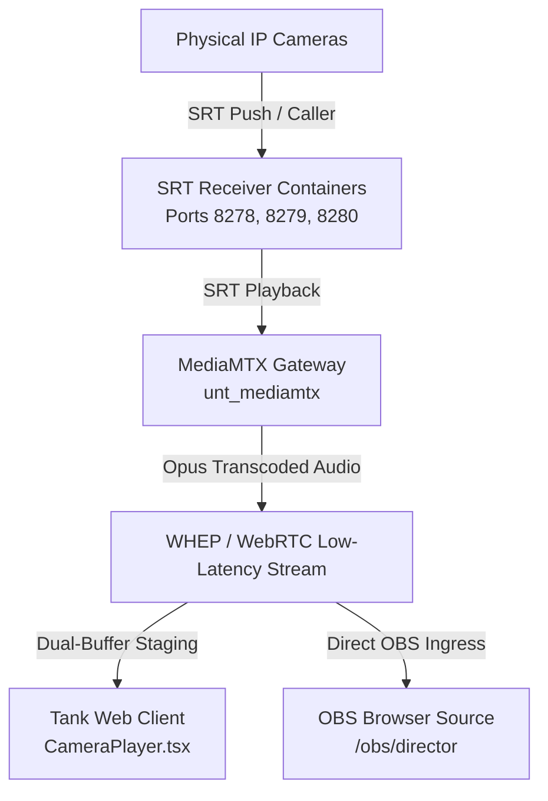

# Tank Platform Architecture, Mobile Engine & House Operations

**Status**: Active & Deployed  
**Deployment**: Production (`tank.unenter.live` / `unt_tank`), Media Gateway (`media.tank.unenter.live` / `unt_mediamtx`), SRT Receivers (`srt-receiver-cam-*`).

---

## 1. Streaming & Media Ingress Architecture

### Ingress & Protocol Handling
- **SRT Receivers**: Dedicated Docker listeners (`datagutt/belabox-receiver:3.6.0`) receive direct H.264 video pushes over SRT.
- **MediaMTX (`unt_mediamtx`)**:
  - Automatically bridges SRT receiver streams into WebRTC (WHEP) and HLS endpoints at `https://media.tank.unenter.live/cameras/cam-<id>/whep`.
  - Transcodes raw G.711 / PCM audio feeds to high-fidelity **Opus** for native browser WebRTC compliance (`-c:v copy -c:a libopus -b:a 64k`).
  - Auto-reconnection: Managed by `runOnInitRestart: true` to seamlessly rebind streams when cameras are power-cycled or rebooted.

---

## 2. TouchDesigner Director Attention & OBS Browser Source Engine

### Director Attention Override Locks
- **Moderator Control Deck ([`HouseConsole.tsx`](file:///Z:/WEBSITES/webbymk2/src/zones/tank/house/HouseConsole.tsx))**:
  - Allows staff to set Director Attention to a specific room (e.g. Living Room for 30m during karaoke or Game Room during a challenge) or an IRL backpack camera.
  - While attention is active, the automated Director **will not switch away** to other rooms until the timer expires or a moderator releases the lock.
- **Multi-Camera Attention Resolvers ([`directorMetrics.ts`](file:///Z:/WEBSITES/webbymk2/src/zones/tank/director/directorMetrics.ts))**:
  - When locked to a room with multiple cameras, the Director dynamically cuts between available camera angles based on active audio/speech decibel peaks (`multiCameraMode = "audio_peak"`).
- **Dedicated OBS Director Browser Source ([`/obs/director`](https://tank.unenter.live/obs/director))**:
  - Direct auto-playing unmuted WebRTC stream for OBS Studio / Streamlabs (`1920x1080`).
  - Parameterized via URL query strings (inspired by Polish-Kick-TTS): `?audio=1&volume=100&hud=1&attention=1&vu=1&crt=1&theme=cctv&lock=living-room`.
  - Visual generator hub located at [`/obs`](https://tank.unenter.live/obs) for 1-click OBS link copying.

---

## 3. High-Traffic Chat Moderation & Automod Scaling

- **Automod Engine ([`chatModerationDb.ts`](file:///Z:/WEBSITES/webbymk2/src/zones/tank/server/chatModerationDb.ts))**:
  - **Blacklist Filter**: Blocks slurs, harassment, dox patterns, and spam words.
  - **Link Filter**: Whitelists trusted platforms (`unenter.live`, `youtube.com`, `kick.com`, `twitch.tv`, `x.com`, `discord.gg`).
  - **Slow Mode**: Configurable rate limits (`Off`, `3s`, `5s`, `10s`, `30s`) to prevent chat flooding.
- **Banned Users & Timeouts**:
  - Persistent blacklist in `tank_platform_settings` under `chat_banned_users`.
  - Realtime broadcast on `tank:chat_moderation` channel.
- **Client DOM Capping & Fast Onboarding ([`ChatConsolePanel.tsx`](file:///Z:/WEBSITES/webbymk2/src/zones/tank/public/components/ChatConsolePanel.tsx))**:
  - Capped to 120 messages in active DOM to maintain 60fps video performance under heavy chat traffic.
  - Floating `[↓ New Messages]` pill when scrolled up.
  - Inline moderation tools (🗑️ Delete, ⏱️ 5m Timeout, 🚫 Ban) on message hover.
  - 1-Click room purge button during raids.

---

## 4. Accessibility Overlay Exclusion
- The floating accessibility overlay button is completely disabled in the Tank zone (`NEXT_PUBLIC_ZONE === "tank"`) across `ConditionalOverlays.tsx`, `LayoutShells.tsx`, and `accessibility.tsx`.
